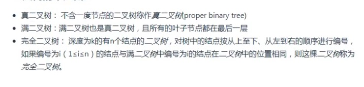

## 树形结构

像数组、栈、队列、默认都是线性结构类型。常见的树形结构有二叉树和多叉树。
开发中常见的树形结构：文件夹目录、DOM结构、路由的配置

### 常见概念
* 节点（根节点、父节点、子节点、兄弟节点）
* 子树（左/右子🌲），子🌲的个数称之为度
* 叶子节点（度为0的节点）非叶子节点（度不为0的节点）
* 节点的深度（从根节点到当前节点所经过的节点总数）
* 节点的高度（从当前节点到最远子节点经过的节点总数）
* 树的层数（🌲的高度、🌲的深度）
* 有序🌲（节点按顺序排列）、无序🌲

### 二叉树常见概念

